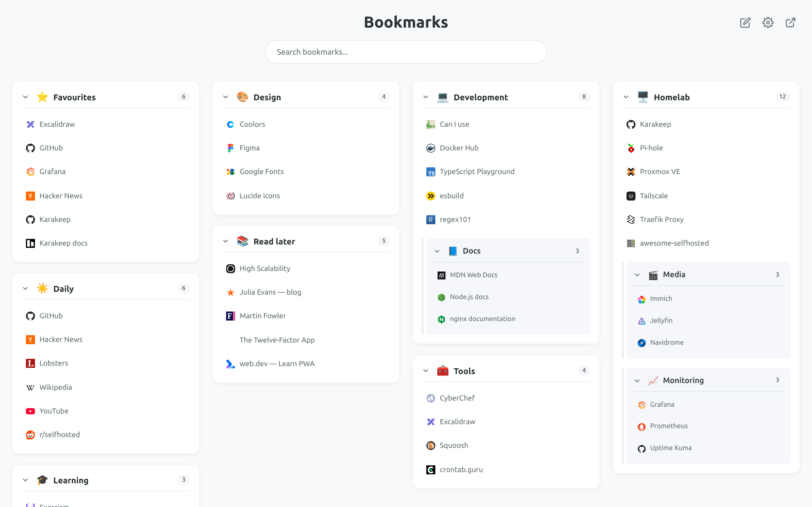
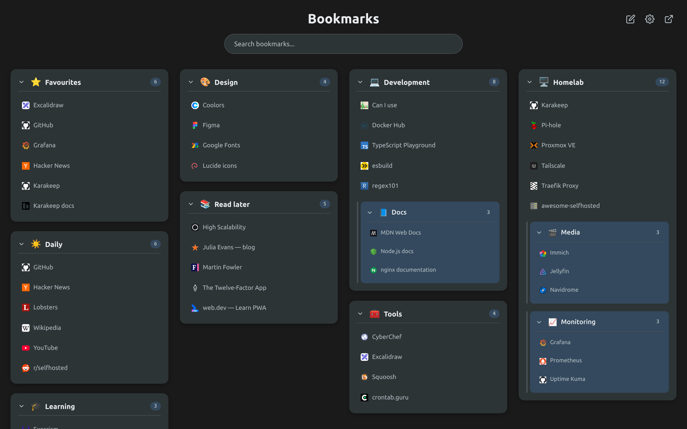
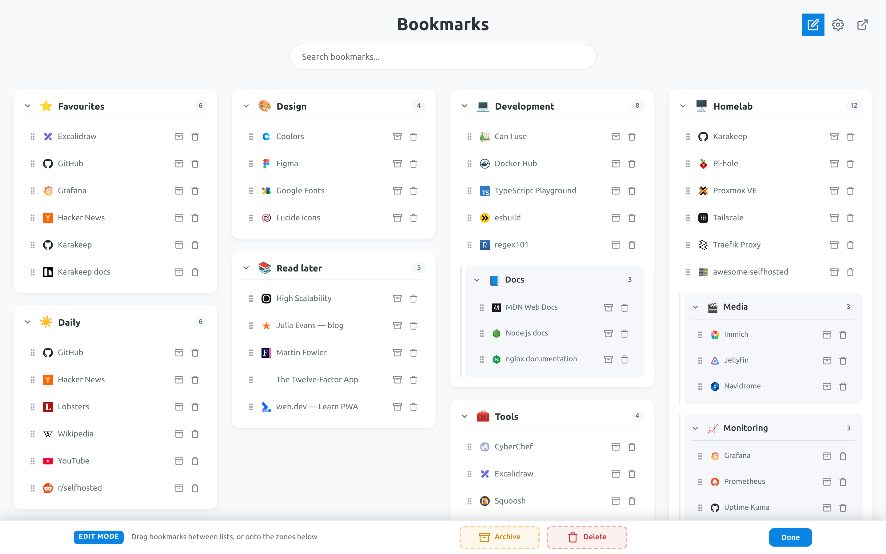
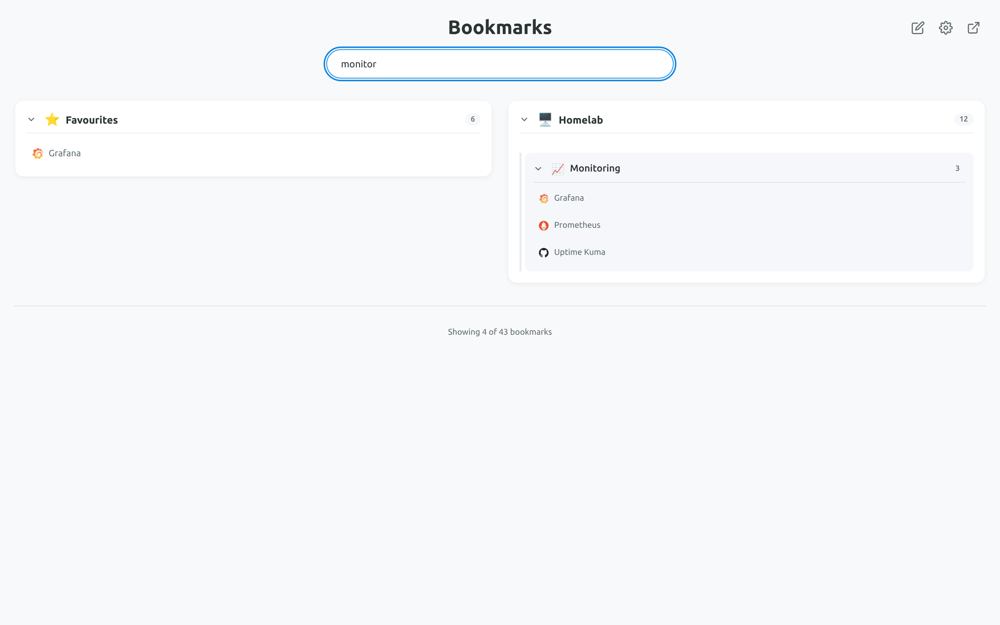
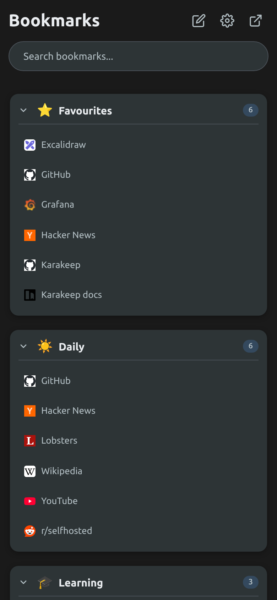

# KaraKeep Dashboard

[](https://github.com/bartlomiejborzucki/karakeep-dashboard/actions/workflows/docker-publish.yml)
[](https://github.com/bartlomiejborzucki/karakeep-dashboard/releases)
[](https://github.com/bartlomiejborzucki/karakeep-dashboard/pkgs/container/karakeep-dashboard)
[](LICENSE)

A fast, self-hosted start page for your [KaraKeep](https://github.com/karakeep-app/karakeep) bookmarks. Every bookmark on one page, organised by list. Bookmark management stays in the full (and excellent) KaraKeep app — this is just the quickest way to *get to* your links.

**[▶ Try the live demo](https://bartlomiejborzucki.github.io/karakeep-dashboard/)** — sample data, nothing to install.

```bash
docker run -d -p 8595:8595 -e KARAKEEP_URL=http://localhost:3000 ghcr.io/bartlomiejborzucki/karakeep-dashboard:latest
```



<table>
  <tr>
    <td width="50%"><br><sub>Automatic dark mode</sub></td>
    <td width="50%"><br><sub>Edit mode: drag between lists, archive or delete</sub></td>
  </tr>
  <tr>
    <td width="50%"><br><sub>Instant, offline search across titles, URLs and tags</sub></td>
    <td width="50%" align="center"><br><sub>Installable PWA, works on phones</sub></td>
  </tr>
</table>

## Features

- 📚 **Masonry layout** — Pinterest-style columns that use the whole screen
- ⚡ **Instant** — renders from a local cache before it makes a single network request
- 🔌 **API-based** — paste an API key once; no database file to mount
- ✏️ **Edit mode & drag & drop bookmarks** — reorder/move bookmarks between lists, drag to archive or trash dropzones, or use quick inline actions
- 📱 **Progressive Web App (PWA)** — installable on desktop and mobile with offline support and native window experience
- 🔍 **Real-time search** — filters as you type, entirely offline
- 🖱️ **Drag & drop columns** — arrange lists across columns; the layout is remembered
- 📴 **Works offline** — the last view stays available when Karakeep is unreachable
- 📱 **Responsive** — desktop, tablet and mobile
- 🏷️ **Tags & descriptions** — searchable always, shown on cards when you want them
- ⭐ **Favourites** — optional card pinned to the top, including favourites that are in no list
- 📂 **Collapsible lists & sublists** — collapse/expand lists and sublists with one click, with bookmark count badges
- 🔒 **No backend** — your API key lives in your browser and is sent only to your own Karakeep; the image is static files on non-root nginx

## Quick start

### Docker Image

```text
ghcr.io/bartlomiejborzucki/karakeep-dashboard:latest
```

### 1. Run it

#### Docker CLI:

```bash
docker run -d \
  --name karakeep-dashboard \
  -p 8595:8595 \
  -e KARAKEEP_URL=http://localhost:3000 \
  --restart unless-stopped \
  ghcr.io/bartlomiejborzucki/karakeep-dashboard:latest
```

#### Docker Compose:

```yaml
services:
  karakeep-dashboard:
    image: ghcr.io/bartlomiejborzucki/karakeep-dashboard:latest
    container_name: karakeep-dashboard
    ports:
      - "8595:8595"
    environment:
      KARAKEEP_URL: http://localhost:3000
    restart: unless-stopped
```

```bash
docker compose up -d
```

### 2. Connect it

1. In KaraKeep, go to **Settings → API Keys** and create a key.
2. Open <http://localhost:8595>.
3. Paste your KaraKeep address and the API key.

That's it. The key is stored in your browser's `localStorage` and used only to call your own KaraKeep instance.

### Adding it to KaraKeep's own compose file

Drop this in next to `web`, `chrome` and `meilisearch` (see `docker-compose.karakeep.yml`):

```yaml
  karakeep-dashboard:
    image: ghcr.io/bartlomiejborzucki/karakeep-dashboard:latest
    container_name: karakeep-dashboard
    restart: unless-stopped
    ports:
      - 8595:8595
    environment:
      KARAKEEP_URL: http://localhost:3000
```

> **`KARAKEEP_URL` must be the address your _browser_ can reach.**
> `http://web:3000` will not work — that hostname only resolves inside Docker, and every
> API call is made by your browser, not by this container. KaraKeep Dashboard needs no shared
> network and no `depends_on`; it only serves static files.

### On Unraid

Until the template is listed in Community Applications, add it by URL: **Docker →
Template repositories**, paste
`https://github.com/bartlomiejborzucki/karakeep-dashboard`, **Save**, then **Add
Container** and pick *karakeep-dashboard*. Set **Karakeep URL** to the address your
browser uses for Karakeep (e.g. `http://192.168.1.50:3000`), apply, and open the WebUI.
The template lives in [`unraid/`](unraid/karakeep-dashboard.xml).

### On a Synology NAS with Dockhand

`docker-compose.synology.yml` is this stack, ready to paste. It works the same in
Portainer or in DSM's own **Container Manager** (**Project → Create →
*Create docker-compose.yml***).

1. **Note your NAS's LAN address** — the one you already type to reach DSM, e.g.
   `192.168.1.50`. Substitute it everywhere below.
2. In **Dockhand → Stacks**, create a new stack called `karakeep-dashboard`.
3. Paste this, with your own address on the `KARAKEEP_URL` line:

   ```yaml
   services:
     karakeep-dashboard:
       image: ghcr.io/bartlomiejborzucki/karakeep-dashboard:latest
       container_name: karakeep-dashboard
       ports:
         # host:container. Change ONLY the left number if 8595 is taken.
         - "8595:8595"
       environment:
         # Karakeep as your BROWSER sees it — the NAS's LAN address, not "localhost"
         # (that is the device you are browsing from) and not a Docker service name.
         KARAKEEP_URL: http://192.168.1.50:3000
       restart: unless-stopped
   ```

4. **Deploy**, open <http://192.168.1.50:8595>, and paste an API key from
   KaraKeep's **Settings → API Keys**.

Even when KaraKeep runs on the same NAS, keep `KARAKEEP_URL` as the LAN address:
`http://web:3000` resolves only inside Docker, and it is your browser that calls the API.

**NAS-specific notes**

- **Nothing to back up, no volume to mount.** The API key, the cached bookmarks and the
  column layout live in the browser (`localStorage` + IndexedDB), per device — so each
  browser pastes the key once, and clearing browsing data signs that browser out. The
  container itself is stateless.
- **Ports.** DSM already uses 5000/5001, and its packages claim plenty more. 8595 is
  normally free; if the deploy fails with *port is already allocated*, change only the
  left-hand number (`"8600:8595"`) and open that port instead.
- **Firewall.** If DSM's firewall is enabled (**Control Panel → Security → Firewall**),
  add an allow rule for the host port.
- **Architecture.** The image is published for `linux/amd64` and `linux/arm64`, which
  covers Intel models and current ARM ones. Older 32-bit ARMv7 units cannot run it.
- **Updating.** Dockhand → the stack → **Redeploy** with *re-pull image*. There is no
  server-side state, so an update cannot lose anything.
- **HTTPS and DSM's reverse proxy.** If you publish KaraKeep Dashboard through **Control Panel →
  Login Portal → Advanced → Reverse Proxy** and open it over `https://`, then KaraKeep
  must be reachable over `https://` too. Browsers refuse to let an `https://` page call
  an `http://` API, and the dashboard will say *"Blocked by the browser"*. Serve both over
  plain `http://` on the LAN, or put both behind the proxy with certificates.
- **Remote access.** There is no login screen in front of KaraKeep Dashboard, so treat the port as
  LAN-only: reach it over Tailscale/WireGuard or behind the reverse proxy's own
  authentication rather than forwarding 8595 on your router.

## Use it with Homepage, Homarr or Dashy

Already running a homelab dashboard? Add KaraKeep Dashboard as a tile, or embed it.
The examples assume it is reachable at `http://192.168.1.50:8595` — use your own address.

**As a link tile** works everywhere with no configuration. The app icon is served at
`/icon-192.png`.

<details>
<summary><b>Homepage</b> (<code>services.yaml</code>)</summary>

```yaml
- Bookmarks:
    - KaraKeep Dashboard:
        href: http://192.168.1.50:8595
        icon: http://192.168.1.50:8595/icon-192.png
        description: All my bookmarks on one page
```

Embedded, with Homepage's iframe widget:

```yaml
- Bookmarks:
    - KaraKeep Dashboard:
        widget:
          type: iframe
          name: karakeep-dashboard
          src: http://192.168.1.50:8595
          classes: h-96 sm:h-96 md:h-[40rem]
```
</details>

<details>
<summary><b>Homarr</b></summary>

Add an **App** with the URL above and the icon URL `http://192.168.1.50:8595/icon-192.png`,
or, to embed it, add an **iFrame** widget pointing at `http://192.168.1.50:8595`.
</details>

<details>
<summary><b>Dashy</b> (<code>conf.yml</code>)</summary>

```yaml
sections:
  - name: Bookmarks
    items:
      - title: KaraKeep Dashboard
        url: http://192.168.1.50:8595
        icon: http://192.168.1.50:8595/icon-192.png
    widgets:
      - type: iframe
        options:
          url: http://192.168.1.50:8595
          frameHeight: 800
```
</details>

**Embedding needs an opt-in.** By default the dashboard refuses to be framed, so another
page cannot overlay it to trick you into clicks while it holds your API key. Allow the
dashboards you trust with `FRAME_ANCESTORS`, a space-separated list of origins (scheme,
host and port, exactly as in your browser's address bar) and/or `self`:

```yaml
    environment:
      KARAKEEP_URL: http://192.168.1.50:3000
      FRAME_ANCESTORS: http://192.168.1.50:3000 https://home.example.com
```

> Browsers keep storage separately for embedded pages. If your homelab dashboard and
> KaraKeep Dashboard live on different hosts, the embedded copy asks for the API key
> once, separately from the copy you open directly. Some browsers (Safari, Firefox
> strict mode) block that storage entirely in cross-site iframes; use a link tile there.

## Configuration

| Setting | Where | Notes |
|---|---|---|
| `KARAKEEP_URL` | container env var | Optional. Only pre-fills the setup form. Never a token. |
| `FRAME_ANCESTORS` | container env var | Optional. Origins allowed to embed the dashboard in an iframe (`self` and/or `http(s)://host[:port]`, space-separated). Unset: embedding is denied. |
| KaraKeep address | setup screen / ⚙ settings | Stored in `localStorage` |
| API key | setup screen / ⚙ settings | Stored in `localStorage`, never leaves your browser |
| Number of columns | ⚙ settings | 2–6, default 4. Changing it resets the saved layout. |
| Open in new tab | ⚙ settings | `target="_blank"` for bookmark links |
| Show tags | ⚙ settings | Off by default. Tags are searchable either way. |
| Show favourites | ⚙ settings | Off by default. A ⭐ Favourites card pinned to the top of the first column (drag it anywhere); one extra request on a full refresh. |
| Include smart lists | ⚙ settings | Off by default |
| Collapse lists by default | ⚙ settings | Off by default |
| Collapse sublists by default | ⚙ settings | Off by default |
| Show bookmark count on lists | ⚙ settings | On by default |
| Column layout | drag & drop | Saved automatically |
| Collapsed list states | click header / toggle | Saved automatically per list |
| Edit mode | header button / Esc | Move bookmarks between lists, archive, or delete |

The ⚙ menu also offers **Refresh now**, **Clear cache** and **Sign out**.

## How it stays fast

Loading is stale-while-revalidate, and the ordering is the whole trick: **nothing on the path to first paint touches the network.**

1. Credentials and preferences come from `localStorage` — synchronous, sub-millisecond.
2. The view model comes from a single IndexedDB read. It is stored already normalized and already sorted, so there is no transformation work at boot: one read, one tree walk, one `innerHTML`.
3. Only *after* the grid is on screen does revalidation start.
4. Revalidation first asks `/users/me/stats` and `/lists` — two cheap requests. If neither the counters nor the lists have changed and the cache is under 15 minutes old, it stops there. Nothing is refetched and the DOM is not touched.
5. Otherwise it fans out across lists (6 at a time, cursor-paginated, `includeContent=false`) and re-renders only if the result actually differs.

A service worker caches favicons, so a warm load issues zero requests for icons, and provides an offline fallback for the app itself. It is network-first for the app and touches nothing but images cross-origin, so it cannot pin you to a stale version.

Bundled assets are content-hashed (`assets/main-9c61bb9f.js`), so they are served `immutable` for a year and a new build invalidates them by changing the URL.

### Search

Search runs against the local cache, so it is instant and works offline. It matches titles, URLs **and tags**. When nothing on the dashboard matches, you are offered a **Search all of Karakeep** button that queries `/bookmarks/search` — that reaches archived bookmarks and ones not in any list, which the dashboard never holds.

### Limits, stated plainly

Counters do not move when a bookmark is *renamed* or *moved between lists*, so those edits are not detected by the cheap check. They are picked up by the 15-minute refresh, by returning to the tab, or by **Refresh now**. This is a deliberate trade: the alternative is 30–40 requests on every single page load.

## Development

TypeScript, bundled with esbuild. The only runtime dependency is SortableJS, and it
is bundled at build time — the published image contains nginx and static files, nothing else.

Requires **Node 24+** (the tests run TypeScript directly, which needs Node's
native type stripping). There is an `.nvmrc`, so `nvm use` picks the right one.

```bash
nvm use            # reads .nvmrc -> Node 24
npm ci             # .npmrc pins the public registry, so no flags are needed
npm run check      # typecheck + tests
npm run build      # -> dist/
npm run dev        # unminified build with inline sourcemaps
npm run build:demo # -> dist-demo/, API replaced by in-memory sample data

# Serve the build any way you like
python3 -m http.server 8595 --directory dist
```

Layout:

```
index.html       shell, CSP, mount points, PWA tags; build.mjs rewrites the asset URLs
styles.css       design system (CSS custom properties, auto dark mode)
manifest.json    PWA web app manifest
env.js           placeholder; regenerated in the container from KARAKEEP_URL
build.mjs        esbuild bundle + content hashing + HTML templating
src/types.ts     API shapes and the normalized model
src/config.ts    constants, storage keys, cache schema version
src/storage.ts   localStorage: credentials + preferences (+ legacy migration)
src/cache.ts     IndexedDB: the view snapshot
src/api.ts       Karakeep REST client: auth, cursor draining, error taxonomy
src/model.ts     normalize -> snapshot -> tree; SQLite BINARY sort order
src/render.ts    HTML generation (escaped), column distribution
src/search.ts    precomputed index, class-based filtering
src/dnd.ts       SortableJS wiring (columns & bookmark drag-and-drop)
src/ui.ts        setup screen, settings, toasts, banner, confirmation modal
src/main.ts      boot orchestration, edit mode and revalidation
src/sw.ts        service worker: PWA shell, favicon cache + offline fallback
src/demo.ts      in-memory API for the demo build (tree-shaken from normal builds)
test/            logic tests, run directly as .ts by node --test
```

`tsconfig.json` checks `src/` under `strict` plus `noUncheckedIndexedAccess`;
`tsconfig.test.json` relaxes the index check for tests, and `tsconfig.sw.json`
type-checks the worker against the WebWorker lib instead of DOM.

### Why CORS just works

KaraKeep's `next.config.mjs` sets `Access-Control-Allow-Origin: *` and allows the
`Authorization` header for `/api/(.*)`, so the browser can call the API directly and no
proxy is needed. If you see a CORS error, a reverse proxy in front of KaraKeep is
stripping those headers.

## Troubleshooting

**"Cannot reach Karakeep"** — Check the address in ⚙ settings. The error box includes a
ready-to-paste `curl` command that shows whether the API is reachable and whether the CORS
headers survive your reverse proxy.

**"Blocked by the browser"** — You are loading this dashboard over `https://` while
KaraKeep is on `http://`. Browsers refuse that combination. Serve both over the same
scheme.

**"API key rejected"** — The key was revoked or mistyped. The dashboard keeps showing your
cached bookmarks and offers a **Reconnect** banner rather than dumping you back to a login
form; generate a new key in KaraKeep and paste it in ⚙ settings.

**"Not a Karakeep instance"** — Nothing answered at `<address>/api/v1`. Check for a path
prefix in your reverse proxy configuration.

**New bookmarks not appearing** — Renames and list moves are not caught by the cheap
change check. Use ⚙ → **Refresh now**, or wait for the 15-minute refresh.

**Nothing answers on `http://<nas-ip>:8595`** — Check that the stack is running and that
the host port is not already taken (Dockhand will have reported *port is already
allocated*), then check DSM's firewall. `curl -I http://<nas-ip>:8595` from another
machine on the LAN separates "container not up" from "blocked on the way in".

**Everything piled into one column after changing the column count** — should not
happen: changing the count clears the saved layout on purpose. If it does, use
⚙ → **Clear cache**.

## Contributing

Contributions welcome. Run `npm run check` before opening a pull request. CI runs the
same checks, then builds the image and smoke-tests it end to end: every asset is
fetched, cache headers are asserted, and `KARAKEEP_URL` is fed a hostile value to
confirm it cannot inject code into the generated `env.js`.

Working with an AI coding agent? [`AGENTS.md`](AGENTS.md) holds the project rules and
invariants for OpenAI Codex, Claude Code (via `CLAUDE.md`) and any other agent that
reads it.

## License

GNU GPL v3 — see the LICENSE file.

## Fork

This project is a fork of [CodeJawn/karakeep-homedash](https://github.com/CodeJawn/karakeep-homedash).

## Acknowledgments

- Forked from [CodeJawn/karakeep-homedash](https://github.com/CodeJawn/karakeep-homedash)
- Built to complement the amazing [KaraKeep](https://github.com/karakeep-app/karakeep)
- Drag & drop by [SortableJS](https://github.com/SortableJS/Sortable)
